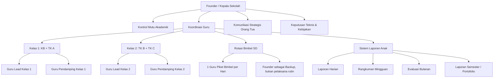
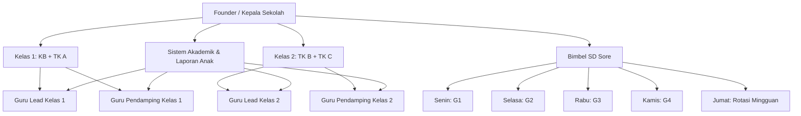
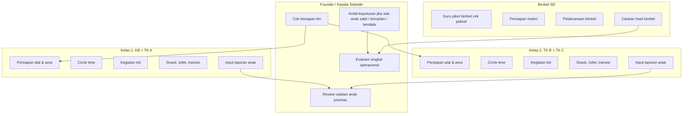
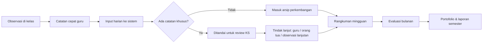
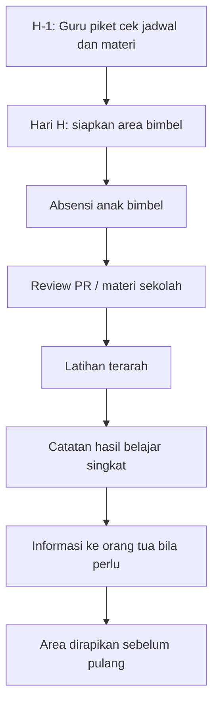
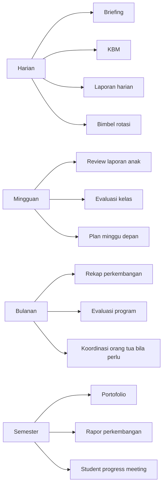
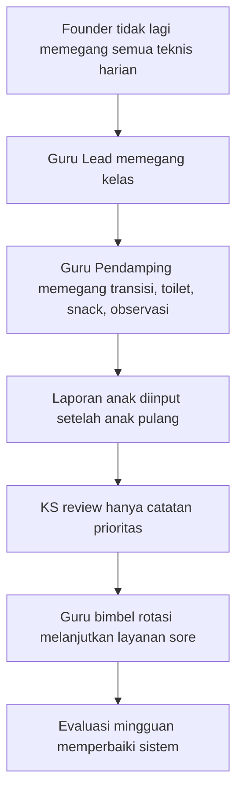

# Workflow Operasional Guru  
## Madani Montessori Islamic School

> **Versi Remastered**  
> Fokus: ringkas, visual, mudah dieksekusi, dan siap diedit ketika jumlah anak per level sudah final.

---

## 0. Ringkasan Eksekutif

| Elemen | Keputusan Operasional |
|---|---|
| Total SDM | **5 orang**: 1 Founder/Kepala Sekolah + 4 Guru |
| Jumlah murid | **32 anak**; komposisi KB, TK A, TK B, TK C belum final |
| Rencana kelas | **2 kelas utama**: KB-TK A dan TK B-TK C |
| Program berjalan | Reguler, Half Day, Bimbel SD |
| Program mendatang | Full Day mulai tahun ajaran depan |
| Sistem akademik | Dirancang untuk laporan harian, mingguan, bulanan, dan semester |
| Prinsip kerja | Founder tetap mengawasi kualitas, tetapi pekerjaan teknis harian dibagi ke guru agar tidak menumpuk di kepala sekolah |

---

## 1. Prinsip Desain Workflow

Workflow ini dibuat untuk sekolah rintisan, sehingga harus:

1. **Ringkas** — guru tidak dibebani laporan terlalu panjang setiap hari.
2. **Jelas** — setiap orang tahu tugas utama, tugas pendukung, dan waktu kerjanya.
3. **Fleksibel** — bisa dipakai saat murid belum terbagi pasti per level.
4. **Terukur** — laporan anak bisa ditarik menjadi laporan mingguan, bulanan, dan semester.
5. **Adil** — bimbel sore dibuat bergilir agar beban guru seimbang.
6. **Siap berkembang** — ketika Full Day berjalan, struktur tidak perlu dirombak total.

---

## 2. Peta Besar Sistem Operasional

---

## 3. Struktur Tim 5 Orang

> Nama guru bisa diganti setelah struktur final. Untuk sementara digunakan kode: **KS, G1, G2, G3, G4**.

| Kode | Role | Tugas Utama | Tugas Pendukung |
|---|---|---|---|
| KS | Founder / Kepala Sekolah | Kontrol mutu, keputusan akademik, supervisi, komunikasi strategis orang tua | Backup kelas saat krisis, review laporan anak, evaluasi guru |
| G1 | Guru Lead Kelas 1 | Memimpin kelas KB-TK A | Input laporan kelas 1, komunikasi ringan orang tua |
| G2 | Guru Pendamping Kelas 1 | Mendampingi KB-TK A, toilet, snack, transisi, observasi | Dokumentasi kelas 1, rotasi bimbel |
| G3 | Guru Lead Kelas 2 | Memimpin kelas TK B-TK C | Input laporan kelas 2, lesson plan lanjutan |
| G4 | Guru Pendamping Kelas 2 / Akademik | Mendampingi TK B-TK C, observasi, material, administrasi akademik | Dokumentasi kelas 2, rotasi bimbel |

---

## 4. Struktur Organisasi Operasional

---

## 5. Pembagian Kelas

| Kelas | Isi Kelas | Fokus Pengelolaan | Guru Utama | Guru Pendamping |
|---|---|---|---|---|
| Kelas 1 | KB + TK A | adaptasi, kemandirian dasar, toilet training, practical life, sensorial awal, adab harian | G1 | G2 |
| Kelas 2 | TK B + TK C | language, mathematics, culture, tahsin/tahfidz lanjutan, kesiapan SD, proyek kecil | G3 | G4 |

### Catatan rasio sementara

Karena komposisi murid per level belum final, gunakan aturan sementara berikut:

| Kondisi | Keputusan |
|---|---|
| Kelas 1 lebih dari 16 anak | KS ikut support saat kedatangan, toilet, dan snack |
| Kelas 2 lebih dari 16 anak | KS ikut support saat kegiatan inti dan transisi pulang |
| Banyak anak baru/adaptasi | Prioritas bantuan KS diberikan ke Kelas 1 |
| Banyak anak TK C persiapan SD | Prioritas supervisi akademik diberikan ke Kelas 2 |

---

## 6. Jam Layanan Sekolah

### 6.1 Program Reguler

| Hari | Jam Anak | Fokus |
|---|---:|---|
| Senin-Kamis | 07.30-10.30 | kegiatan inti, pembiasaan, snack, closing |
| Jumat | 07.30-10.00 | kegiatan lebih ringkas, pembiasaan Jumat, closing awal |

### 6.2 Program Half Day

| Hari | Jam Anak | Fokus |
|---|---:|---|
| Senin-Kamis | 07.30-13.00 | reguler + makan siang + istirahat ringan + enrichment |
| Jumat | 07.30-12.30 | reguler Jumat + makan + closing half day |

### 6.3 Rencana Program Full Day

| Hari | Jam Anak | Fokus |
|---|---:|---|
| Senin-Kamis | 07.30-16.00 | reguler + makan + istirahat + enrichment + project + closing sore |
| Jumat | 07.30-15.30 | full day versi ringkas Jumat |

### 6.4 Bimbel SD

| Keterangan | Keputusan Operasional |
|---|---|
| Waktu | Setelah kegiatan TK selesai, menyesuaikan jadwal harian |
| Selesai | Sekitar 17.00 |
| Guru | 1 guru per hari secara bergantian |
| Founder | Backup jika ada guru berhalangan, bukan pelaksana rutin |

---

## 7. Alur Harian Versi Ringkas

```mermaid
flowchart LR
    A[06.45-07.15\nGuru datang & persiapan] --> B[07.15-07.30\nPenyambutan awal]
    B --> C[07.30-08.00\nCircle time & pembiasaan]
    C --> D[08.00-09.15\nKegiatan inti Montessori-Islamic]
    D --> E[09.15-09.45\nSnack, toilet, cuci tangan]
    E --> F[09.45-10.30\nKegiatan lanjutan / closing reguler]
    F --> G[10.30-11.15\nPulang reguler & komunikasi singkat]
    G --> H[11.15-13.00\nHalf Day: makan, istirahat, enrichment]
    H --> I[13.00-16.00\nFull Day: project, ibadah, review, closing]
    I --> J[Setelah TK\nBimbel SD sampai sekitar 17.00]
```

---

## 8. Timeline Kerja Guru

### 8.1 Senin-Kamis

| Waktu | Kegiatan | KS | G1 | G2 | G3 | G4 |
|---|---|---|---|---|---|---|
| 06.45-07.15 | Persiapan sekolah, briefing, cek kelas | A | R | R | R | R |
| 07.15-07.30 | Penyambutan anak | A | R | R | R | R |
| 07.30-08.00 | Circle time & pembiasaan | C | R | S | R | S |
| 08.00-09.15 | Kegiatan inti Montessori-Islamic | C | R | S | R | S |
| 09.15-09.45 | Snack, toilet, cuci tangan | C | S | R | S | R |
| 09.45-10.30 | Kegiatan lanjutan & closing reguler | C | R | S | R | S |
| 10.30-11.15 | Penjemputan reguler | A | R | R | R | R |
| 11.15-13.00 | Half Day: makan, istirahat, enrichment | C | R/S | R/S | R/S | R/S |
| 13.00-16.00 | Full Day: project, ibadah, review, closing | A | R/S | R/S | R/S | R/S |
| Setelah TK-17.00 | Bimbel SD | B | Rotasi | Rotasi | Rotasi | Rotasi |

**Kode:**  
A = accountable / penanggung jawab akhir  
R = responsible / pelaksana utama  
S = support / pendukung  
C = check / kontrol atau supervisi  
B = backup

### 8.2 Jumat

| Waktu | Kegiatan | Catatan |
|---|---|---|
| 06.45-07.15 | Persiapan & briefing singkat | Fokus agenda Jumat |
| 07.30-10.00 | Program reguler Jumat | Lebih ringkas dari hari biasa |
| 10.00-10.45 | Penjemputan reguler | Komunikasi penting saja |
| 10.45-12.30 | Half Day Jumat | Makan, ibadah, closing |
| 12.30-15.30 | Full Day Jumat | Enrichment ringan, review, closing |
| Setelah TK-17.00 | Bimbel jika ada | Guru piket Jumat bergilir mingguan |

---

## 9. Workflow Harian per Role

---

## 10. Sistem Akademik dan Laporan Tumbuh Kembang

### 10.1 Tujuan Sistem

Sistem akademik tidak boleh membuat guru habis waktu hanya untuk mengetik. Sistem harus membantu guru:

- mencatat kejadian penting anak,
- melihat perkembangan anak dari waktu ke waktu,
- membuat laporan orang tua lebih cepat,
- menyiapkan portofolio dan rapor semester,
- memberi kepala sekolah data untuk supervisi.

---

## 11. Alur Laporan Anak

---

## 12. Jenis Laporan Anak

| Jenis Laporan | Frekuensi | Isi Ideal | Pelaksana | Reviewer |
|---|---|---|---|---|
| Harian | Setiap hari sekolah | mood, makan, toilet, fokus, interaksi, catatan khusus | Guru kelas + pendamping | KS cek anak prioritas |
| Mingguan | Jumat / akhir pekan | ringkasan capaian, kendala, rencana stimulasi | Guru lead kelas | KS |
| Bulanan | Akhir bulan | perkembangan per aspek, catatan dukungan, rekomendasi | Guru lead + pendamping | KS |
| Semester | Akhir semester | portofolio, capaian perkembangan, narasi rapor | Guru lead | KS final review |

---

## 13. Standar Input Laporan Harian

### 13.1 Format minimal per anak

| Field | Contoh Isi |
|---|---|
| Mood | ceria / tenang / butuh adaptasi / mudah menangis |
| Kegiatan utama | practical life: menuang air; language: kartu huruf; tahfidz: murojaah pendek |
| Fokus belajar | fokus 10 menit, perlu pendampingan saat transisi |
| Sosial-emosional | bermain bersama 2 teman, masih perlu latihan menunggu giliran |
| Makan/toilet | makan cukup, toilet mandiri / perlu bantuan |
| Catatan khusus | sempat menangis saat ditinggal, membaik setelah didampingi |
| Tindak lanjut | besok diberi aktivitas yang sama untuk penguatan |

### 13.2 Aturan redaksi

| Jangan Tulis | Ganti Dengan |
|---|---|
| Anak nakal | Anak masih perlu dibimbing untuk menunggu giliran |
| Anak malas | Anak belum menunjukkan minat pada aktivitas hari ini |
| Anak susah diatur | Anak membutuhkan instruksi lebih singkat dan pengulangan |
| Anak tidak bisa | Anak masih dalam tahap awal mencoba |

---

## 14. RACI Matrix Operasional

| Aktivitas | KS | G1 | G2 | G3 | G4 |
|---|---|---|---|---|---|
| Briefing pagi | A | R | R | R | R |
| Penyambutan anak | A | R | R | R | R |
| Kelas KB-TK A | C | A/R | R | I | I |
| Kelas TK B-TK C | C | I | I | A/R | R |
| Snack & toilet | C | S | A/R | S | A/R |
| Penjemputan | A | R | R | R | R |
| Laporan harian anak | C | A/R | R | A/R | R |
| Review anak prioritas | A/R | C | C | C | C |
| Lesson plan | C | A/R | S | A/R | S |
| Dokumentasi kegiatan | C | S | R | S | R |
| Bimbel SD | B | Rotasi | Rotasi | Rotasi | Rotasi |
| Komunikasi komplain orang tua | A/R | C | I | C | I |
| Evaluasi mingguan | A | R | R | R | R |

**Legenda:**  
A = accountable / penanggung jawab akhir  
R = responsible / pelaksana  
C = consulted / diajak konsultasi  
I = informed / perlu mengetahui  
B = backup

---

## 15. Rotasi Bimbel SD

### 15.1 Pola Dasar Mingguan

| Hari | Guru Bimbel | Catatan |
|---|---|---|
| Senin | G1 | Fokus setelah laporan kelas 1 selesai |
| Selasa | G2 | G1 bisa pulang lebih awal jika tugas selesai |
| Rabu | G3 | Fokus penguatan materi SD |
| Kamis | G4 | G3 bisa fokus persiapan kelas besok |
| Jumat | Rotasi mingguan | Supaya beban Jumat tidak selalu orang yang sama |

### 15.2 Rotasi Jumat

| Minggu | Guru Jumat |
|---|---|
| Minggu 1 | G1 |
| Minggu 2 | G2 |
| Minggu 3 | G3 |
| Minggu 4 | G4 |
| Minggu 5 | Kembali ke G1 |

### 15.3 Aturan Swap

| Kondisi | Aturan |
|---|---|
| Guru sakit | Tukar dengan guru berikutnya, catat di grup internal |
| Guru ada komunikasi orang tua penting | Guru lain menggantikan bimbel, KS menyetujui |
| Bimbel banyak anak | KS menentukan apakah perlu 1 pendamping tambahan |
| Bimbel kosong | Guru piket bimbel membantu input laporan / persiapan kelas |

---

## 16. Workflow Bimbel

---

## 17. Pola Briefing dan Evaluasi

### 17.1 Briefing Pagi

| Durasi | Isi Briefing | Output |
|---|---|---|
| 5-10 menit | anak yang perlu perhatian, agenda harian, tugas piket, catatan bimbel, kebutuhan kelas | semua guru tahu prioritas hari itu |

### 17.2 Closing Siang

| Durasi | Isi Closing | Output |
|---|---|---|
| 10-15 menit | kejadian penting, anak prioritas, laporan yang harus diinput, kebutuhan besok | tidak ada informasi anak yang hilang |

### 17.3 Evaluasi Mingguan

| Waktu | Isi Evaluasi | Output |
|---|---|---|
| Jumat / akhir minggu | laporan anak, kendala kelas, bimbel, komunikasi orang tua, kebutuhan alat | daftar tindak lanjut minggu depan |

---

## 18. Kalender Ritme Kerja

---

## 19. Rencana Transisi Menuju Full Day

| Fase | Waktu | Fokus | Risiko | Antisipasi |
|---|---|---|---|---|
| Fase 1 | Sebelum tahun ajaran | desain jadwal, kebutuhan guru, kebutuhan ruang | jadwal belum realistis | simulasi 1 minggu |
| Fase 2 | Bulan pertama | adaptasi anak dan guru | anak lelah, guru overload | kegiatan siang dibuat ringan |
| Fase 3 | Bulan kedua | stabilisasi laporan dan ritme kelas | laporan tertunda | batasi laporan harian pada poin penting |
| Fase 4 | Bulan ketiga | evaluasi program | jadwal bimbel bentrok | revisi rotasi guru |

---

## 20. Jadwal Full Day yang Direkomendasikan

### Senin-Kamis

| Waktu | Kegiatan | Catatan |
|---|---|---|
| 07.30-10.30 | Program inti reguler | Montessori-Islamic, snack, closing reguler |
| 10.30-11.30 | Transisi, toilet, makan siang | lebih tenang, tidak akademik berat |
| 11.30-12.30 | Istirahat / quiet time | wajib untuk menjaga stamina anak |
| 12.30-13.30 | Enrichment ringan | art, story, practical life, project kecil |
| 13.30-14.30 | Outdoor / motorik / Islamic activity | tidak terlalu padat kognitif |
| 14.30-15.30 | Review, portofolio, aktivitas pilihan | guru observasi dan catat perkembangan |
| 15.30-16.00 | Closing dan penjemputan Full Day | komunikasi singkat orang tua |
| 16.00-17.00 | Bimbel SD | 1 guru rotasi |

### Jumat

| Waktu | Kegiatan | Catatan |
|---|---|---|
| 07.30-10.00 | Program inti Jumat | ringkas |
| 10.00-12.30 | Half Day Jumat | makan, ibadah, closing |
| 12.30-15.30 | Full Day Jumat | kegiatan ringan dan review |
| 15.30-17.00 | Bimbel jika ada | rotasi Jumat |

---

## 21. Checklist Harian Guru

### 21.1 Sebelum Anak Datang

- [ ] Hadir tepat waktu.
- [ ] Ikut briefing pagi.
- [ ] Cek kelas, toilet, dan alat belajar.
- [ ] Cek jadwal anak khusus atau catatan kesehatan.
- [ ] Siapkan lesson plan dan material utama.

### 21.2 Saat Anak Datang

- [ ] Sambut anak dengan salam dan sikap tenang.
- [ ] Catat kondisi anak jika ada info dari orang tua.
- [ ] Bantu anak transisi ke kelas.
- [ ] Pisahkan catatan penting untuk guru kelas.

### 21.3 Saat KBM

- [ ] Jalankan kegiatan sesuai lesson plan.
- [ ] Observasi anak secara natural.
- [ ] Catat kejadian penting, bukan semua kejadian kecil.
- [ ] Jaga bahasa positif dan adab guru.

### 21.4 Setelah Anak Pulang

- [ ] Rapikan kelas dan alat.
- [ ] Input laporan harian anak.
- [ ] Tandai anak yang butuh review KS.
- [ ] Siapkan kebutuhan besok.
- [ ] Guru piket bimbel lanjut persiapan bimbel.

---

## 22. Template Laporan Harian Anak

| Field | Isi |
|---|---|
| Nama Anak |  |
| Tanggal |  |
| Kelas | KB / TK A / TK B / TK C |
| Mood Hari Ini |  |
| Kegiatan Utama |  |
| Capaian Positif |  |
| Hal yang Perlu Didampingi |  |
| Makan / Toilet |  |
| Catatan Khusus |  |
| Tindak Lanjut Besok |  |
| Guru Pencatat |  |

---

## 23. Template Rangkuman Mingguan

| Field | Isi |
|---|---|
| Nama Anak |  |
| Minggu Ke |  |
| Area yang Berkembang |  |
| Area yang Perlu Stimulasi |  |
| Sosial-Emosional |  |
| Kemandirian |  |
| Bahasa / Kognitif |  |
| Catatan Islami / Adab |  |
| Rencana Minggu Depan |  |
| Perlu Komunikasi Orang Tua? | Ya / Tidak |

---

## 24. Template Evaluasi Bulanan

| Aspek | Catatan Guru | Tindak Lanjut |
|---|---|---|
| Nilai agama dan moral |  |  |
| Sosial-emosional |  |  |
| Bahasa |  |  |
| Kognitif |  |  |
| Motorik |  |  |
| Seni |  |  |
| Kemandirian |  |  |
| Montessori work habit |  |  |
| Catatan khusus |  |  |

---

## 25. Aturan Agar Workflow Tetap Jalan

1. **Tidak semua hal harus diputuskan Founder.**  
   Guru lead boleh menyelesaikan hal rutin sesuai SOP.

2. **Laporan harian tidak boleh terlalu panjang.**  
   Cukup fakta penting dan tindak lanjut.

3. **Catatan khusus anak harus naik ke KS.**  
   Terutama sakit, tantrum berulang, konflik berulang, perubahan perilaku, atau komplain orang tua.

4. **Bimbel tidak boleh mengganggu laporan anak TK.**  
   Guru piket bimbel menyelesaikan laporan inti sebelum bimbel dimulai.

5. **Full Day harus bertahap.**  
   Jangan langsung menambah beban akademik siang hari. Siang harus lebih ringan, ritmis, dan banyak aktivitas tenang.

---

## 26. Versi Implementasi 30 Hari Pertama

| Minggu | Fokus | Target |
|---|---|---|
| 1 | Uji pembagian 2 kelas | guru paham role dan alur harian |
| 2 | Uji laporan harian anak | format laporan tidak memberatkan guru |
| 3 | Uji rotasi bimbel | jadwal bimbel tidak bentrok dengan tugas TK |
| 4 | Evaluasi dan revisi | workflow final disesuaikan dengan realita lapangan |

---

## 27. Keputusan yang Masih Perlu Diisi Nanti

| Data | Status | Dampak ke Workflow |
|---|---|---|
| Jumlah anak KB | belum final | menentukan beban Kelas 1 |
| Jumlah anak TK A | belum final | menentukan kebutuhan pendamping Kelas 1 |
| Jumlah anak TK B | belum final | menentukan beban Kelas 2 |
| Jumlah anak TK C | belum final | menentukan fokus kesiapan SD |
| Jumlah anak bimbel SD | belum final | menentukan apakah 1 guru cukup |
| Nama guru | belum final | mengganti kode G1-G4 |
| Sistem akademik yang dipakai | belum final | menentukan format input laporan |

---

## 28. Rekomendasi Final Struktur Harian

---

## 29. Penutup Operasional

Workflow ini adalah versi awal yang dirancang untuk kondisi sekolah rintisan. Struktur ini sudah cukup aman untuk berjalan dengan 5 orang, 32 anak, 2 kelas utama, bimbel sore, dan rencana Full Day.

Kunci keberhasilannya bukan pada banyaknya form, tetapi pada konsistensi tiga hal:

1. guru tahu tugasnya,
2. laporan anak masuk tepat waktu,
3. founder hanya mengambil keputusan yang memang perlu level kepala sekolah.
