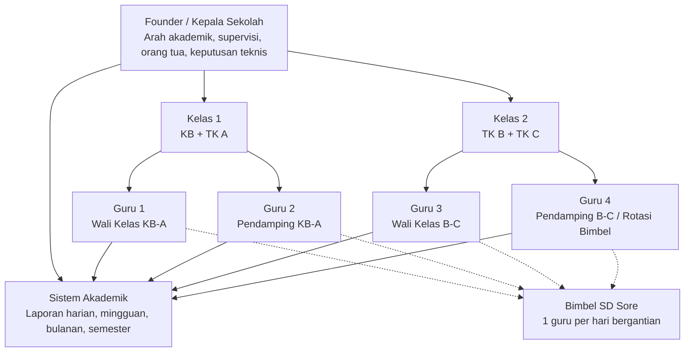
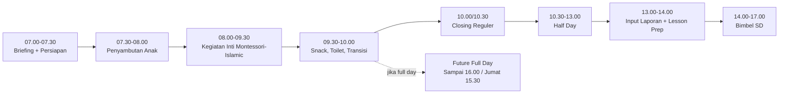
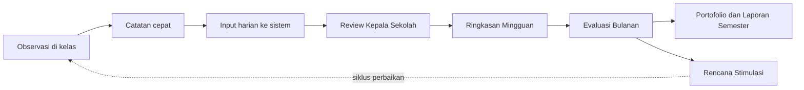

# Workflow Operasional Guru - Madani Montessori Islamic School

**Unit:** Kelompok Bermain dan Taman Kanak Kanak Islam Terpadu MADANI MONTESSORI Islamic School  
**Tim:** 5 orang total: 1 Founder/Kepala Sekolah + 4 guru  
**Murid:** 32 anak KB, TK A, TK B, TK C (distribusi per jenjang belum final)  
**Program:** Reguler, Half Day, rencana Full Day, dan Bimbel SD sore

## 1. Struktur Tim

## 2. Timeline Harian

## 3. Workflow Pelaporan Tumbuh Kembang

## 4. Rotasi Bimbel

| Hari | Guru Piket Bimbel | Catatan |
|---|---|---|
| Senin | Guru 1 | Sampai sekitar 17.00 |
| Selasa | Guru 2 | Sampai sekitar 17.00 |
| Rabu | Guru 3 | Sampai sekitar 17.00 |
| Kamis | Guru 4 | Sampai sekitar 17.00 |
| Jumat | Rotasi ringan / opsional | Sesuaikan pendaftar dan beban guru |

## 5. Jam Program

| Program | Senin-Kamis | Jumat |
|---|---:|---:|
| Reguler | 07.30-10.30 | 07.30-10.00 |
| Half Day | 07.30-13.00 | 07.30-12.30 |
| Full Day (rencana) | 07.30-16.00 | 07.30-15.30 |
| Bimbel SD | setelah TK selesai - 17.00 | menyesuaikan |

## 6. Aturan Kunci

1. Guru yang piket bimbel tidak diberi tugas administrasi berat pada hari yang sama.
2. Founder/Kepala Sekolah memegang quality control dan keputusan teknis, bukan semua tugas operasional kecil.
3. Laporan harian harus ringkas, sedangkan analisis panjang dipindah ke mingguan/bulanan.
4. Saat Full Day mulai berjalan, minimal harus ada 2 orang dewasa yang tetap tersedia untuk anak full day jika bimbel berjalan bersamaan.
